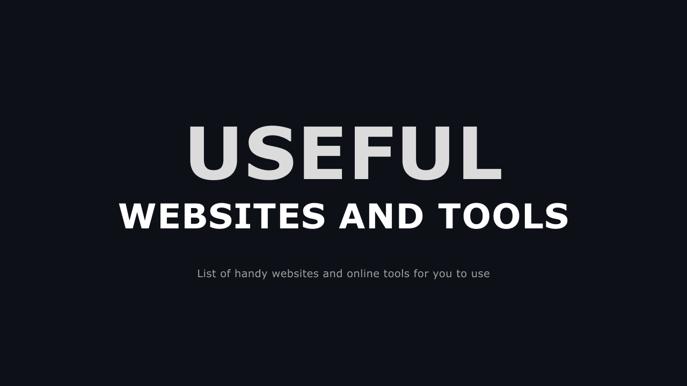

# Useful Websites and Online Tools

A list of highly useful FREE websites and online tools to make our work faster, better and more convenient.

> Feel free to [contribute](#question-how-to-contribute) to this repo!

# :link: Table of Contents

  - [Books](#books)
  - [Converters](#converters)
  - [Documents](#pagefacingup-documents)
  - [Design](#design)
  - [Free Images](#free-images)
  - [Frontend Web Development](#computer-frontend-web-development)
  - [Image Editor](#scissors-image-editor)
  - [Text Generator](#text-generator)
  - [To-Do List / Note Taking / Project Management](#to-do-list--note-taking--project-management)
  - [Video Editing](#videocamera-video-editing)
  - [Virtual Whiteboard](#virtual-whiteboard)

# :question: How to Contribute?

**1. Fork this repository**

- Click on the <code>Fork</code> button to create a copy of this repository.

**2. Make changes in the README.md file**

- Edit the README.md file to add the name of the tool/website, link and a one-line description.

> :exclamation: Important: 
> 
> Make sure to add the name of websites/tools in an alphabetical order inside the table.

**3. Raise a pull request.**

**4. Review** 

- Your pull request will be reviewed and merged with the master branch!

Congratulations! You are now a contributor. :raised_hands:

# :telephone_receiver: Contact

Reach me on Twitter: 

Username: [@SumanSo77216044](https://twitter.com/SumanSo77216044)

---

# :clipboard: List of Websites and Tools

## Books

| Name/Link | Description |
|:---|:---|
| [What Should I Read Next?](https://www.whatshouldireadnext.com/) | Enter a book you like and the site will analyse our huge database of real readers' favorite books to provide book recommendations and suggestions for what to read next |

## Converters

| Name/Link | Description |
|:---|:---|
| [CloudConvert](https://cloudconvert.com/) | An online file converter. Audio, video, document, ebook, archive, image, spreadsheet, etc are supported |
| [SmallPDF](https://smallpdf.com/) | All the tools you’ll need to be more productive and work smarter with documents |
| [WEBP to PNG](https://cloudconvert.com/webp-to-png) | Convert images in Webp format to PNG and vice versa |
| [Word to PDF](https://smallpdf.com/word-to-pdf) | Free and simple online PDF converter to create PDFs from Word documents. No file size limits, no watermarks |

## Design

| Name/Link | Description |
|:---|:---|
| [Canva](https://www.canva.com/) | Create social media posts, presentations, posters, videos, logos and more |
| [Color Hunt](https://colorhunt.co/) | Discover the newest hand-picked color palettes. Get color inspiration for your design and art projects |
| [Coolors](https://coolors.co/) | Create the perfect palette or get inspired by thousands of beautiful color schemes |
| [Figma](https://www.figma.com/) | Design, prototype, and gather feedback all in one place with Figma |
| [Penpot](https://penpot.app/) | Penpot makes design and prototyping accessible to every team in the world |

## :page_facing_up: Documents

| Name/Link | Description |
|:---|:---|
| [eSign PDF](https://smallpdf.com/sign-pdf) | Sign documents online with electronic signature. No registration needed |

## Free Images

| Name/Link | Description |
|:---|:---|
| [Dreamstime](https://www.dreamstime.com/) | Royalty-Free Stock Photos |
| [Freepik](https://www.freepik.com/) | Download the best high-quality photos, designs and mockups |
| [Pexels](https://www.pexels.com/) | Free stock photos & videos you can use everywhere  |
| [Pixabay](https://pixabay.com/) | High quality stock images, videos and music |
| [Shutterstock](https://www.shutterstock.com/) | Best royalty free images from Shutterstock, including photos, vectors, and illustrations |
| [Unsplash](https://unsplash.com/) | Beautiful, free images and photos that you can download and use for any project |

## :computer: Frontend Web Development

| Name/Link | Description |
|:---|:---|
| [Animista](https://animista.net/) | Generate code for CSS animations |
| [Favicon.ico Generator](https://www.favicon.cc/) | A tool to create or download favicon.ico icons, that get displayed in the address bar of every browser |
| [Haikei](https://haikei.app/) | Generate unique SVG design assets |
| [Image Extractor](https://extract.pics/) | Extract images from any public website by using a virtual browser |
| [Online Gradient Generator](https://angrytools.com/gradient/) | Create gradient code in RGBA, HEX, Canvas, SVG, SwiftUI, etc. and use the generated CSS code |

## :scissors: Image Editor

| Name/Link | Description |
|:---|:---|
| [Angry Web Tools](https://angrytools.com/) | Online Gradient Generator, Image Crop, Color Picker, Blob Generator, etc |
| [Images Platform](https://www.imagesplatform.com/post/online-tool-to-resize-any-image-to-1280-x-720-resolution-rxJmd) | Online Tool To Resize Any Image To 1280 X 720 Resolution |
| [Remove Image Background](https://www.remove.bg/) | Remove backgrounds 100% automatically in 5 seconds with one click |
| [TinyPNG](https://tinypng.com/) | Compression techniques to reduce the file size of your WEBP, JPEG and PNG files |

## Text Generator

| Name/Link | Description |
|:---|:---|
| [Free lorem ipsum generator](https://www.freeformatter.com/lorem-ipsum-generator.html) | This free lorem ipsum generator lets you choose how many sentences, paragraphs or list items you want |

## To-Do List / Note Taking / Project Management

| Name/Link | Description |
|:---|:---|
| [Asana](https://asana.com/) | Keep remote and distributed teams, and your entire organization, focused on their goals, projects |
| [Evernote](https://evernote.com/) | Powerful tool that can help executives, entrepreneurs and creative people capture and arrange their ideas |
| [Notion](https://www.notion.so/) | Notion is a single space where you can think, write, and plan |
| [Taskade](https://www.taskade.com/) | Taskade is the ultimate to-do list app for managing tasks, writing notes, and collaborating with others |

## :video_camera: Video Editing

| Name/Link | Description |
|:---|:---|
| [Kamua](https://kamua.com/) | Resize video, cut video, caption video. All inside a browser. |
| [VEED](https://www.veed.io/) | Create videos with a single click. Add subtitles, transcribe audio and more |

## Virtual Whiteboard

| Name/Link | Description |
|:---|:---|
| [Excalidraw](https://excalidraw.com/) | Virtual whiteboard for sketching hand-drawn like diagrams. Collaborative and end-to-end encrypted |
| [Web Whiteboard](https://webwhiteboard.com/) | Brainstorm, share ideas, manage projects with instant collaboration |

---

:arrow_up: **[Back to top](#link-table-of-contents)**

Thanks for visiting!

*If you find this helpul, don't forget to :star: this repository.*
